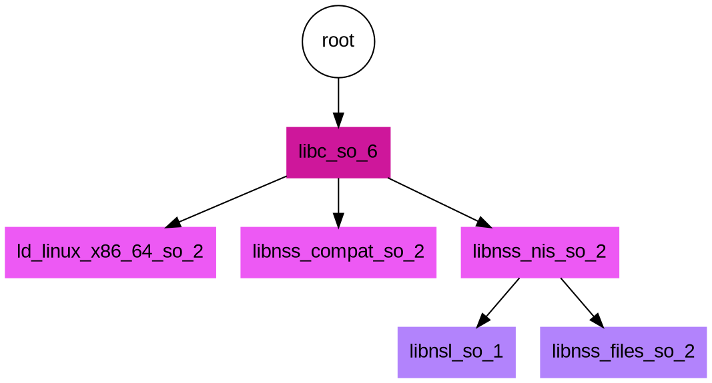

I recently had the desire to trace a process - the reason and context aren't important,
but my colleague pointed me at <a href="https://man7.org/linux/man-pages/man7/rtld-audit.7.html" target="_blank">rtld-audit</a>,
which is (I quote) an "auditing API for the dynamic linker." What this means in practice is
that you (or me) the developer can write a set of known functions defined by the API into a shared library, and then 
provide the shared library to any command via the `LD_AUDIT` environment variable.
As a quick example, let's say I write my custom shared library, `libaudit.so`, and I want to use
it to audit the command `whoami`. I might do this:

```bash
LD_AUDIT=./auditlib.so whoami
```

If your functions print metadata about the calls, you'd see that output. Or maybe you want
to change execution and return different values, or (like me) just save output to file.
A nice way to think about this is that your library functions are subscribing to events.
By writing these API functions, we get handles to listen in.
For example, every time a library is searched for by the linker, a function is called.
Or when a symbol bind occurs between a library that has it and one that needs it,
another event (function) is called. Since we get to *write* those functions, that means
that we get to subscribe to the events and then inspect contents, or heck, even return
something different. There are many use cases here - the obvious one is true to the name,
if you wanted to <a href="https://www.sentinelone.com/labs/leveraging-ld_audit-to-beat-the-traditional-linux-library-preloading-technique/" target="_blank">audit loaded objects</a> for security, or even do code injection.
It's interesting how the same API can be used both maliciously and for security, but
I won't go into that. For my use case, I simply wanted to get a list of shared libraries
loaded and write them to yaml.

## LD_AUDIT and Yaml

I decided it would be fun to write my own custom functions to "trace" (or audit)
what the linker is doing, and save the contents to file. I wanted to:

<ol class="custom-counter">
  <li> Write and compile my own libaudit.so</li>
  <li> Run it with some command to save output to file (YAML).</li>
  <li> Visualize the results (what loads what)</li>
</ol>

This tiny adventure is provided and documented at <a href="https://github.com/buildsi/ldaudit-yaml" target="_blank">ldaudit-yaml</a>
and it was lovely. For the remainder of this post, I'll walk through the various steps and what I learned
along the way. This is such a neat, powerful little API and I suspect others could find it useful too.
But please, do not be evil with it.

### Version

There is a function called `la_version` that is supposed to act like a handshake, and is always supposed to be called.

> This is the only function that must be defined by an auditing library: it performs the initial handshake between the dynamic linker and the auditing library.  When invoking this function, the dynamic linker passes, in version, the highest version of the auditing interface that the linker supports.

Interestingly, for my early test cases I was following the <a href="https://www.sentinelone.com/labs/leveraging-ld_audit-to-beat-the-traditional-linux-library-preloading-technique/" target="_blank">example from here</a> to create both LD_AUDIT and LD_PRELOAD
shared libraries, but ran into some kind of bug where having the preload done meant we never hit the audit:

```yaml
$ make run
LD_AUDIT=./auditlib.so LD_PRELOAD=./preloadlib.so whoami
I'm loaded from LD_PRELOAD vanessasaur
```

I can't explain what's going on, but when I wrote and compiled the auditlib.so without the preload, it worked fine.
Once I added the preload, the auditlib didn't produce any output. I never figured out why, but eventually removing
the preload library fixed everything. If anyone wants to test this out on their machine, I created an <a href="https://github.com/buildsi/ldaudit-yaml/tree/main/version_only" target="_blank">example directory</a> to (hopefully) reproduce it. I suspect it's some weird niche bug. Thankfully,
I could continue working once I removed the preload library and added other functions to the audit one.

### Parsing Events

At first, I just defined the <a href="https://man7.org/linux/man-pages/man7/rtld-audit.7.html" target="_blank">rtld-audit functions</a> (not all of them)
and starting printing output. A lot of this exercise was trying to understand the events, and what the different flags meant.
Once I had this printing to the screen, I decided I wanted a way to print to file, because the output would always
be mixed with whatever the program was doing. I decided to use YAML since the events are parsed as they come, and it wouldn't be clear
when we'd need to close up some json data structure to complete a list of events.
On the other hand, we could start the data structure with an init or constructor function. Note
that I did try to add a destructor, but it was never called, and I suspect this happened because my
shared library doesn't have a main function. Another idea I had was to close up the file given that
the library being called is being closed (these events appear at the end of the output) but then I couldn't
be sure that other loading events were also finished for dependencies, and I'd also need to maintain some state
to tag and identify the first library (or executable) being called. Using YAML seemed like a more
straight forward, less error prone thing to do.

### The Events!

So a little more about these events - there are a few different types (written in my own words)

<ol class="custom-counter">
  <li> A library is being loaded</li>
  <li> A search is being done for a library</li>
  <li> Some other activity </li>
  <li> A symbol is being bound</li>
  <li> A library is being closed</li>
</ol>

At the onset I only included the first three, and I found that I was missing information (to be discussed in a bit).
For the actual events linked to functions you can read more closely  <a href="https://man7.org/linux/man-pages/man7/rtld-audit.7.html" target="_blank">here</a>.

### Writing to File

I decided to use a fairly simply, possibly error prone strategy to write to file. I'd allow the user to define
an environment variable for an output file, and given that it's defined, write output to the file instead of the console.
I did this via a constructor function, which is always called at the beginning:

```cpp

// Prepare output file for writing
__attribute__((constructor))
static void init(void) {
    // Do we want to write output to a file?
    char * out = getenv("LDAUDIT_OUTFILE");
    
    // Prepare file for writing
    if (out) {
        initFile(out);
    }
}
```

And the initFile function will basically prepare the file for writing, meaning attempting to create
the new output file (if it already exists, content will be over-written):

```cpp

// Init file clears the file to prepare for new output
static void initFile(char * filename) {
    std::fstream file;
    file.open(filename, std::ios::out);
    if(!file) {
      printf("Error in creating output file.\n");
      exit (EXIT_FAILURE);
    }
    file.close();
}  
```

And then since we can't really easily keep a state (and I'd rather not play around with global state)
to print I opted to do something similar, writing a function to again look for this variable and print to file (or not).

```cpp

// Shared function for printing output to file or terminal
static void doPrint(std::string output) {
  char * out = getenv("LDAUDIT_OUTFILE");
    
  // Open for append to write, and then close
  // This is obviously not ideal for many writes, but I don't
  // see an easy way to do this without having an exit function.
  if (out) {
     std::ofstream file;
     file.open(out, std::ios_base::app);
     if (!file) {
        printf("Error writing to output file.\n");
        exit (EXIT_FAILURE);
     }
     file << output;
     file.close();
  } else {
      std::cout << output;
  }
}
```

And then for any given function, I could just prepare a YAML string and send it off to doPrint.
Here is an example for the version function, or the "handshake."

```cpp

unsigned int la_version(unsigned int version) {
  // If version == 0 the library will be ignored by the linker.
  if (version == 0) {
    return version;
  } 

  // Prepare output - top of the yaml, and first event (version)
  std::string output = "auditlib:\n  la_version: " + std::to_string(version) + "\n  audits:\n";
  output += "  - event: handshake\n    function: la_version\n    value: " + std::to_string(version) + "\n";
  doPrint(output);

  return LAV_CURRENT;
}
```

The reason this is awful and error prone is because we are opening the same file so many times.
For dummy testing purposes it's probably okay, but I'd shirk at running this for some production thing
with a lot more things running and libraries being loaded (and thus the filesystem being stressed). Do you
have any other ideas for how we could better write to file? 

### Basic Usage

This meant that the whole shabang to write to an output file looks like this:

```bash

$ export LDAUDIT_OUTFILE=ldaudit.yaml 
$ g++ -fPIC -shared -O3 -g -o auditlib.so auditlib.cpp
LD_AUDIT=./auditlib.so whoami
vanessasaur
```

Note that the output is being saved to file, and the result of the `whoami` command is still in the console.
The output would be in ldaudit.yaml. And of course I added a Makefile to run
this for me:

```bash

$ make 
$ make run
```

The Makefile is basically compiling, as shown above, and running:

```bash

 $ export LDAUDIT_OUTFILE=ldaudit.yaml
 $ LD_AUDIT=./auditlib.so whoami
```

And then you won't see terminal output, but it will be in <a href="https://github.com/buildsi/ldaudit-yaml/tree/main/ldaudit.yaml" target="_blank">ldaudit.yaml</a>.
Here is the tippety top of that:

```bash
LD_AUDIT=./auditlib.so whoami
auditlib:
  la_version: 1
  audits:
  - event: handshake
    function: la_version
    value: 1
  - event: object_loaded
    name: ""
    function: la_objopen
    identifier: 0x7f2bc9bd6610
    flag: LM_ID_BASE
    description: Link map is part of the initial namespace
  - event: object_loaded
    name: "/lib64/ld-linux-x86-64.so.2"
    function: la_objopen
    identifier: 0x7f2bc9bd5e68
    flag: LM_ID_BASE
    description: Link map is part of the initial namespace
  - event: activity_occurring
    function: la_activity
    initiated_by: 0x7f2bc9bd6610
    flag: LA_ACT_ADD
    description: New objects are being added to the link map.
  - event: searching_for
    function: la_objsearch
    name: "libc.so.6"
    initiated_by: 0x7f2bc9bd6610
    flag: "LA_SER_ORIG"
  - event: searching_for
    function: la_objsearch
    name: "/lib/x86_64-linux-gnu/libc.so.6"
    initiated_by: 0x7f2bc9bd6610
    flag: "LA_SER_CONFIG"
  - event: object_loaded
    name: "/lib/x86_64-linux-gnu/libc.so.6"
    function: la_objopen
    identifier: 0x7f2bc96425b0
    flag: LM_ID_BASE
    description: Link map is part of the initial namespace
...
vanessasaur
```

Notice anything about the data? I looked at this and saw a simple enough logic to create a small graph, discussed next.

### Visualizing Results

I wanted to generate a small tree with the executable call at the top, and dependnecies branching off of that as nodes.
So I decided to go for dot (a <a href="https://en.wikipedia.org/wiki/DOT_(graph_description_language)" target="_blank">graph description language</a>)
that I could easily turn into a graphic. The pattern in the data I noticed was that we would typically have some number of searches, prompted by a library
(identified by the identifer) following by an object load event. From the "initiated_by" field of the search I could link a library that was then loaded to a searched prompted by a library, and write <a href="https://github.com/buildsi/ldaudit-yaml/blob/main/generate_dot.py" target="_blank">a small Python script</a> to generate the dot file. I'd run the script as follows against the YAML output to describe the events:

```bash
python generate_dot.py ldaudit.yaml > audit.dot
```

The dot file looks like this - it's such a nice syntax you can basically read the graph!



And for those familiar with <a href="https://linux.die.net/man/1/dot" target="_blank">dot</a>, I can generate a png like this:

```bash
$ dot -Tpng audit.dot -o audit.png
```

And have the entire thing in a Makefile generated like:

```bash
$ make dot
```

And the final image looks like this!

<div class="padding:20px">

</div><br>

See anything wrong? I didn't at first either, because I was so happy to see the cute little tree. But when I came back to check, there were issues, discussed next! This isn't totally correct - continue reading to learn why!

### Verifying the Graph

I wanted to verify that the graph above was correct, so I decided to
first look at the ELF DT_NEEDED headers to follow the chain that we see above.
For those not familar, this field is actually called `DT_NEEDED` and from <a href="https://refspecs.linuxfoundation.org/elf/elf.pdf" target="_blank">the Executable and Linking Format (ELF)</a> Standard:

> This element holds the string table offset of a null-terminated string, giving  the name of a needed library. The offset is an index into the table recorded  in the DT_STRTAB entry. See "Shared Object Dependencies'' for more information about these names. The dynamic array may contain multiple 
entries with this type. These entries' relative order is significant, though their relation to entries of other types is not.

We can use a tool like <a href="https://man7.org/linux/man-pages/man1/readelf.1.html" target="_blank">readelf</a> to print out (and grep or filter)
for NEEDED. Note that you can also use <a href="https://man7.org/linux/man-pages/man1/ldd.1.html" target="_blank">ldd</a> to print shared object dependencies. Checking our original executable `whoami` with readelf checked out - it needs libc.6.so (our root pointing down one level):

```bash
$ readelf -d $(which whoami)| grep NEEDED
 0x0000000000000001 (NEEDED)             Shared library: [libc.so.6]
```

But then when I did the same for libc6.so, I was surprised to only see one entry:

```bash
$ readelf -d /lib/x86_64-linux-gnu/libc.so.6 | grep NEEDED
 0x0000000000000001 (NEEDED)             Shared library: [ld-linux-x86-64.so.2]
```

And further, I didn't see that particular entry linked to the node, it was up by itself at the top.
So there were two issues. One - that the image shows "extra" libraries being loaded, and
it's not just the image, the ld audit trace showed them too. I'm calling them "extra" because they 
aren't present in the NEEDED headers, so possibly they are found another way? And two there is
a missing link between the ld-linux-x86-64.so.2 (seen in NEEDED) 
and libc.so.6.


#### 1. Where are the extra libraries from?

For the first issue, I did enough searching until I think I found an answer! 
it looks like libc.so.6 loads these libraries dynamically with dlopen, and you
can see almost the exact issue I faced  <a href="https://stackoverflow.com/questions/31106735/chgrp-and-linked-libraries" target="_blank">in this thread</a>. So this is really neat because we are getting more information from our approach
than we might have with just a static analysis using readelf. You can likely poke
around the glibc source code and see if you can find some dlopens.

#### 2. Missing a Needed Symbol

I was trying to make up reasons for why the NEEDED entry might not be there -
could it be that we don't use whatever part of the library that needs it? Or perhaps once it's loaded there is no additional
output by the linker that we need to find it again? Surely the linker cannot be smart enough
to know exactly what bit of another library is needed and skip loading it if there isn't overlap.
I wasn't satsisfied with these ideas, so I wrote an additional function to parse symbols, or more specifically,
to tell us whenever there was a symbol bind between a library that needed it
and one that provided it. Once I did this, I could clearly see that libc.so.6 
(identifier `0x7f3a5afa9550`)

```yaml
 - event: object_loaded
    name: "/lib/x86_64-linux-gnu/libc.so.6"
    function: la_objopen
    identifier: 0x7f3a5afa9550
    flag: LM_ID_BASE
    description: Link map is part of the initial namespace
```

was in fact loading symbols from ld-linux-x86-64.so.2 (identifier 0x7f3a5b545e68)

```yaml
 - event: object_loaded
    name: "/lib64/ld-linux-x86-64.so.2"
    function: la_objopen
    identifier: 0x7f3a5b545e68
    flag: LM_ID_BASE
    description: Link map is part of the initial namespace
```

We can see that here:

```yaml
  - event: symbol_bind
    name: "_dl_find_dso_for_object"
    function: la_symbind32
    where_needed: 0x7f3a5afa9550
    where_defined: 0x7f3a5b545e68
    index_symbol: 15
    description: Unknown
  - event: symbol_bind
    name: "__tunable_get_val"
    function: la_symbind32
    where_needed: 0x7f3a5afa9550
    where_defined: 0x7f3a5b545e68
    index_symbol: 21
    description: Unknown
```

So I updated my image generation tool to take these loads into consideration, and here is the final image!

<div class="padding:20px">

</div><br>


To clarify the above - our call to `whoami` (root) directly needs libc.so.6. libc.so.6 loads symbols from  `/lib64/ld-linux-x86-64.so.2`,
but also dynamically loads the other two (*.nis and *compat) via a dlopen call. And finally, the leaves of the tree (the bottom
two node) are indeed needed by libnss_nis.so.2:

```bash
$ readelf -d /lib/x86_64-linux-gnu/libnss_nis.so.2 | grep NEEDED
 0x0000000000000001 (NEEDED)             Shared library: [libnsl.so.1]
 0x0000000000000001 (NEEDED)             Shared library: [libnss_files.so.2]
 0x0000000000000001 (NEEDED)             Shared library: [libc.so.6]
```

The interesting thing is that even though libc.6.so is needed here, we don't see it actually get searched for, nor
do we see symbols get bound. I'm not sure I have an answer for this one, but please <a href="https://github.com/buildsi/ldaudit-yaml" target="_blank">open an issue</a> for discussion if you might! I'm a bit pooped now to dig deeper, at least for the time being.

### Other tidbits

It's also possible to build a docker container, and I have an <a href="https://github.com/buildsi/ldaudit-yaml/pkgs/container/ldaudit-yaml" target="_blank">automated build</a> of a container that provides the shared library if you quickly want to use it.

## Conclusion

I really enjoyed playing around with this API, and learning about LD_AUDIT this week. If you want to play around with my code, 
check out the <a href="https://github.com/buildsi/ldaudit-yaml" target="_blank">repository</a>.  

Of a similar feather, LD_PRELOAD is a similar <a href="http://www.goldsborough.me/c/low-level/kernel/2016/08/29/16-48-53-the_-ld_preload-_trick/" target="_blank">trick</a>,
but probably simpler because it just loads your shared libraries first (possibly before another that has an equivalent symbol).
I think LD_AUDIT is cooler because it's a bit lesser known, and can in fact be run before the LD_PRELOAD to actually audit that,
and <a href="https://github.com/ForensicITGuy/libpreloadvaccine" target="_blank">here is an example</a> I found of someone doing that.
Also note that Solaris has it's own <a href="https://docs.oracle.com/cd/E36784_01/html/E36857/chapter6-1246.html#scrolltoc" target="_blank">similar audit api</a> and the functions are similar but not exact (e.g., I see an extra la_objfilter and la_callinit and la_callentry). So please
go forth, and play around with this! And remember that these libraries can be used <a href="https://lwn.net/Articles/412048/" target="_blank">irresponsibly</a> so if you do find a potential security issue, best to report it. 
